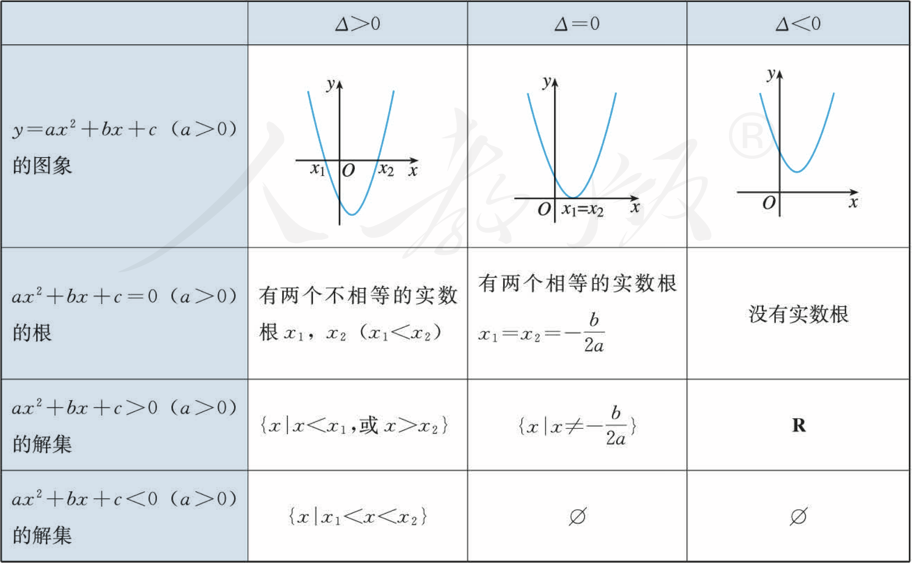

# 不等式

## 不等式

- [不等式 - 维基百科](https://zh.wikipedia.org/zh-cn/不等式)

## 性质

:::tip

这些性质基本上是“正确的废话”，简单了解即可，无需记住。

:::

### 等式的性质

- $a=a$（自反性）
- ‌$a=b\Rightarrow b=a$（对称性）
- $a=b,b=c\Rightarrow a=c$（传递性）
- $a=b\Rightarrow a\pm c=b\pm c,ac=bc,\frac{a}{c}=\frac{b}{c}$（$c\ne 0$）（替代性）

:::tip

替代性：如果两个对象相等，那么在任何出现它们的位置，都可以用一个替代另一个，等式仍然成立。

:::

### 不等式的性质

- $a>b\Rightarrow b<a$（对称性）
- $a>b,b>c\Rightarrow a>c$（传递性）
- $a>b\Rightarrow a\pm c>b\pm c$
- $a>b,c>0\Rightarrow ac>bc,c<0\Rightarrow ac<bc$
- $a>b,c>d\Rightarrow a+c>b+d$（加法单调性）
- $a>b>0,c>d>0\Rightarrow ac>bd$（乘法单调性）
- $a>b>0,n>0\Rightarrow a^n>b^n,n<0\Rightarrow a^n<b^n$

### 常用技巧

1. 减法可以转化为加法：$a-b=a+(-b)$，而除法可以转化为乘法：$\frac{a}{b}=a\times \frac{1}{b}$。
2. 比较两个正数 $a,b>0$ 的常用方法：通过做差比较 $a-b$ 与 $0$ 的关系；通过做商比较 $\frac{a}{b}$ 与 $1$ 的关系。

## 二次方程与不等式

### 方程

**方程** 是含有未知数的 **等式**。

初中阶段我们学过 **一元二次方程**，一般形式为：

$$
ax^2+bx+c=0(a\ne 0)
$$

### 不等式

我们把等式改为不等式就得到了 **一元二次不等式**，一般形式为：

$$
ax^2+bx+c<0\text{或}ax^2+bx+c>0(a\ne 0)
$$

<Desmos id="s8qv3vgffa" />

### 求解

求解一元二次不等式的方法与方程类似。

如果 $a<0$，先将其转换为 $a>0$ 的形式，然后计算判别式 $\Delta=b^2-4ac$。

《人教版高中数学·必修一》的表格总结了各种情况的对应关系：

:::example

解不等式 $-x^2+5x<6$。

化为标准形式 $x^2-5x+6>0$。

其中 $a=1,b=-5,c=6,\Delta=b^2-4ac=1$。

解得 $x_1=2,x_2=3$，所以解集为 $x\in(-\infty,2)\cup(3,\infty)$。

:::

## 基本不等式

### 引入

利用 [完全平方差公式](transition#平方公式) 可以得到一个不等式：

$$
(a-b)^2=a^2+b^2-2ab\ge 0
$$

对于任意实数 $a$ 和 $b$，有：

$$
a^2+b^2\ge 2ab
$$

当且仅当 $a=b$ 时，等号成立。

### 定义

特别地，如果 $a>0,b>0$，用 $\sqrt{a}$ 代替 $a$，$\sqrt{b}$ 代替 $b$，可得到 **基本不等式**。

对于正实数 $a$ 和 $b$，有：

$$
\sqrt{ab}\le\frac{a+b}{2}
$$

当且仅当 $a=b$ 时，等号成立。

:::tip

“基本不等式”不是一个严格的数学术语，但在《人教版高中数学·必修一》中，将上述不等式称为基本不等式，它实际是下文中均值不等式的一个特例。

:::

### 均值

其中 $\frac{a+b}{2}$ 是正数 $a,b$ 的 **算术平均数**，$\sqrt{ab}$ 是正数 $a,b$ 的 **几何平均数**。

该不等式表明：两个正数的算术平均数一定 **大于等于** 它们的几何平均数。

还有两种等价形式：

$$
a+b\ge 2\sqrt{ab}
$$

$$
ab\le\frac{(a+b)^2}{4}
$$

:::example

已知实数 $x>0$，求 $x+\frac{1}{x}$ 的最小值。

根据基本不等式：

$$
x+\frac{1}{x}=a+b\ge 2\sqrt{ab}=2\sqrt{x\cdot\frac{1}{x}}=2
$$

所以 $x+\frac{1}{x}$ 的最小值为 $2$。

:::

### 几何证明

基本不等式还有一种优雅的几何证明：

设 $AC=a,BC=b$，则半径 $AB=AC+BC=a+b$。

根据相似三角形，$CD=\sqrt{ab}$，而弦 $DE=2CD=2\sqrt{ab}$。

因为 $AB\ge DE$，所以 $a+b\le 2\sqrt{ab}$。当且仅当 $a=b$ 时，等号成立。

<Desmos id="hzzctb8v6z" />

## 扩展

### 均值不等式

对于正实数 $a$ 和 $b$，有：

$$
\frac{2}{\frac{1}{a}+\frac{1}{b}}\le\sqrt{ab}\le\frac{a+b}{2}\le\sqrt{\frac{a^2+b^2}{2}}
$$

推广到更多数的情况，对于正实数 $x_1,x_2,\dots,x_n$，都有：

$$
H_n\le G_n\le A_n\le Q_n
$$

调和平均数（Harmonic Mean）：

$$
H_n=\frac{n}{\sum_{i=1}^n\frac{1}{x_i}}
$$

几何平均数（Geometric Mean）：

$$
G_n=\sqrt[n]{\prod_{i=1}^n x_i}
$$

算术平均数（Arithmetic Mean）：

$$
A_n=\frac{\sum_{i=1}^n x_i}{n}
$$

平方平均数（Quadratic Mean）：

$$
Q_n=\sqrt{\frac{\sum_{i=1}^n x_i^2}{n}}
$$

### 柯西-施瓦茨不等式

对于正实数 $a,b,x,y$，有：

$$
(a^2+b^2)(c^2+d^2)\ge(ac+bd)^2
$$

当且仅当 $ad=bc$ 时，等号成立。

记忆方法：**平方和的乘积** $\ge$ **乘积和的平方**（**方和积** 大于 **积和方**）

:::example

已知实数 $x,y$ 满足 $x^2+y^2=3$，求 $5x+2y$ 的最大值。

根据柯西不等式：

$$
(5x+2y)^2=(ac+bd)^2\le (a^2+b^2)(c^2+d^2)=(5^2+2^2)(x^2+y^2)=87
$$

即：

$$
(5x+2y)^2\le 87\Rightarrow 5x+2y\le\sqrt{87}
$$

所以 $5x+2y$ 的最大值为 $\sqrt{87}$。

:::

### 权方和不等式

$$
\frac{a^2}{x}+\frac{b^2}{y}\ge\frac{(a+b)^2}{x+y}
$$

:::example

已知实数 $x,y>0$ 满足 $\frac{1}{x}+\frac{4}{y}=1$，求 $x+y$ 的最小值。

根据权方和不等式：

$$
1=\frac{1^2}{x}+\frac{2^2}{y}=\frac{a^2}{x}+\frac{b^2}{y}\ge\frac{(a+b)^2}{x+y}=\frac{(1+2)^2}{x+y}=\frac{9}{x+y}
$$

即：

$$
1\ge\frac{9}{x+y}\Rightarrow x+y\ge 9
$$

所以 $x+y$ 的最小值为 $9$。

:::
