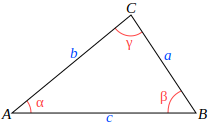
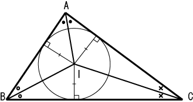
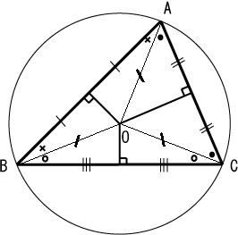
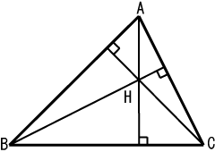
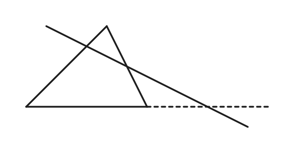

# 解三角形

## 参考资料

- [三角形 - 维基百科](https://zh.wikipedia.org/zh-cn/三角形)
- [【最全汇总】最全三角形面积公式！我赌你只会五个（doge） - bilibili](https://www.bilibili.com/video/BV1RTg5zgE1m)

## 约定

对于三角形 $\triangle ABC$，如果没有特别说明，则：

1. 三边长 $a$、$b$、$c$ 分别为三个角 $\angle A$、$\angle B$、$\angle C$ 的对边。
2. $S$ 表示三角形的 **面积**，$s=\frac{a+b+c}{2}$ 表示三角形的 **半周长**。
3. $r$ 表示 **内切圆** 的半径，$R$ 表示 **外接圆** 的半径。

## 基本方法

### 基本原理

回忆初中平面几何，根据全等三角形的判断：

如果知道 ASA、AAS、SAS、SSS、HL 就可以唯一的确定一个三角形。

总结一下就是两个角全都可以，三个边可以，一个角两个边就需要是夹角。

即知道 $aCb$、$cBa$、$bAc$，才可以唯一确定一个两边一角的三角形。

至于 SSA，只有一个角是直角才可以唯一确定，不过这个就是 HL 了。

三角形确定，意味着我们可以求出所有边的长度以及所有角度的大小。

正弦定理、余弦定理就为我们提供了方法：可以利用角度和边长互相表示。

像这样，确定三角形边、角的过程，就是解三角形。

如何选择正弦定理、余弦定理？

遇到正弦选正弦定理，遇到齐次式考虑正弦定理。

遇到余弦选余弦定理，遇到边的二次齐次式考虑余弦定理。

原则：边角统一。

### 三角函数

在三角形中，

$$
\global\let\vec=\overrightarrow
A+B+C=\pi
$$

因此就有：

$$
\begin{aligned}
\sin A&=\sin(B+C)\\
\sin B&=\sin(A+C)\\
\sin C&=\sin(A+B)
\end{aligned}
$$

$$
\begin{aligned}
\cos A&=-\cos(B+C)\\
\cos B&=-\cos(A+C)\\
\cos C&=-\cos(A+B)
\end{aligned}
$$

$$
\begin{aligned}
\sin\frac{A}{2}&=\cos\left(\frac{B+C}{2}\right)\\
\sin\frac{B}{2}&=\cos\left(\frac{A+C}{2}\right)\\
\sin\frac{C}{2}&=\cos\left(\frac{A+B}{2}\right)
\end{aligned}
$$

$$
\begin{aligned}
\cos\frac{A}{2}&=\sin\left(\frac{B+C}{2}\right)\\
\cos\frac{B}{2}&=\sin\left(\frac{A+C}{2}\right)\\
\cos\frac{C}{2}&=\sin\left(\frac{A+B}{2}\right)
\end{aligned}
$$

在三角形中，$a=b\cos C+c\cos B$。

若 $\sin^2A+\sin^2B=\sin^2C$，则该三角形是以 $\angle C$ 为直角的 $\mathrm{Rt\triangle}$。

解三角形里面常用的奇怪三角函数：

$$
\sin15^\circ=\cos75^\circ={\sqrt6-\sqrt2\over4}
$$

$$
\sin75^\circ=\cos15^\circ={\sqrt6+\sqrt2\over4}
$$

特殊的，如果 $\sin 2A=\sin 2B$，则有 $2A=2B$ 或 $2A+2B=\pi$，即 $A=B$ 或 $A+B=90^\circ$，即等腰或直角三角形。

### 平面几何法

利用平面几何定理，直接解决。

通常平面几何关注的是角与边的关系。

角，联系三角函数，倒角解决。

边，通常联系正余弦定理，以及一些特殊的定理。

建系法：将数据用坐标表示，详见解析几何。

如果直角三角形三边成等差数列，则变长一定为 $3,4,5$。

### 向量基底法

用向量基底分解，利用点乘的性质解决。

通常情况下，向量法是一个好用而简洁的方法。

算两次原理：用同一组基底，用不同方式表示一个向量，则系数一定相等。

### 三角形应用

基线：在测量过程中，根据测量的需要而确定的线段叫做基线。

仰角：在同一铅垂平面内，视线在水平线上方时与水平线的夹角。

俯角：在同一铅垂平面内，视线在水平线下方时与水平线的夹角。

方向角：从正北或正南方向到目标方向所形成的小于九十度的角。

方位角：从某点的指北方向线起依顺时针方向到目标方向线之间的水平夹角。

## 三角法定理

### 正弦定理

回顾初中几何，三角形面积，

$$
S={1\over2}ab\sin C={1\over2}bc\sin A={1\over2}ac\sin B
$$

下面的证明过程只考虑锐角三角形，对于钝角三角形，结论不变。

做过 $\angle A$ 的垂线，则该垂线长度 $h$：

$$
h=b\sin C=c\sin B
$$

对每个角应用，最后可得，

$$
{a\over\sin A}={b\over\sin B}={c\over\sin C}=k
$$

做出该三角形的外接圆，过圆心做 $BC$ 的高，则，

$$
a=2R\sin A,\,{a\over\sin A}=2R
$$

即值 $k$ 为三角形外接圆直径 $2R$。

常常这么写：

$$
a=2R\sin A,\,b=2R\sin B,\,c=2R\sin C
$$

$$
\sin A={a\over2R},\,\sin B={b\over2R},\,\sin C={c\over2R}
$$

对于任意 $\triangle ABC$，有：

$$
\frac{a}{\sin\angle A}=\frac{b}{\sin\angle B}=\frac{c}{\sin\angle C}=2R
$$

正弦定理推论：大边对大角，小边对小角。

### 余弦定理

在 $\triangle ABC$ 中，

$$
\begin{array}{c}
\overrightarrow{AB}=\overrightarrow{CB}-\overrightarrow{CA}\\[0.5em]
|\overrightarrow{AB}|^2=|\overrightarrow{CB}|^2+|\overrightarrow{CA}|^2-2|\overrightarrow{CB}|\cdot|\overrightarrow{CA}|\cdot\cos\theta\\[0.5em]
c^2=a^2+b^2-2ab\cos\theta
\end{array}
$$

其中 $\theta$ 为 $c$ 的对角，即 $\angle C$；第二步就是两边平方。

常写作：

$$
\cos A={b^2+c^2-a^2\over2bc},\,\cos B={a^2+c^2-b^2\over2ac},\,\cos C={a^2+b^2-c^2\over2ab}
$$

对于任意 $\triangle ABC$，有：

$$
a^2=b^2+c^2-2bc\cos A
$$

$$
b^2=a^2+c^2-2ac\cos B
$$

$$
c^2=a^2+b^2-2ab\cos C
$$

:::tip

**勾股定理** 实际上是 **余弦定理** 在一个角为 **直角** 时的特殊情形。

当 $\angle C=90^\circ$ 时，有 $\cos\angle C=0$，代入余弦定理公式得到：

$$
c^2=a^2+b^2
$$

但直接用余弦定理证明勾股定理，可能会构成 **循环论证**，因为余弦定理本身可能依赖于勾股定理的成立。

:::

推论：

$$
\begin{aligned}
a^2+b^2-c^2>0 &\Longrightarrow \cos C>0 \Longrightarrow C\in(0,\pi/2)\\
a^2+b^2-c^2=0 &\Longrightarrow \cos C=0 \Longrightarrow C=\pi/2\\
a^2+b^2-c^2<0 &\Longrightarrow \cos C<0 \Longrightarrow C\in(\pi/2,\pi)
\end{aligned}
$$

### 余切定理

$$
\begin{aligned}
\zeta&=\sqrt{{1\over p}(p-a)(p-b)(p-c)}\\
p&={a+b+c\over2}
\end{aligned}
$$

其中 $\zeta$ 为 $\triangle ABC$ 内切圆半径，$p$ 为三角形的半周长。

推论，一各三角形内切圆半径为，

$$
R_{\text{内}}={2S\over a+b+c}
$$

其中 $S$ 表示三角形面积，$a,b,c$ 分别表示三边长。

### 正切定理

正切定理指出，三角形中，两条边的和与差的比值，等于这两条边的对角的和与差的一半的正切的比值：

$$
{a-b\over a+b}={\tan{\angle A-\angle B\over2}\over\tan{\angle A+\angle B\over2}}
$$

## 三角形四心

|   编号   | 心的名称 |           定义           |
| :------: | :------: | :----------------------: |
| $X_1(I)$ |   内心   | 三条 **角平分线** 的交点 |
| $X_2(G)$ |   重心   |   三条 **中线** 的交点   |
| $X_3(O)$ |   外心   |  三条 **中垂线** 的交点  |
| $X_4(H)$ |   垂心   |   三条 **高线** 的交点   |

### 奔驰定理

在锐角 $\triangle ABC$ 中，

$$
S_{\triangle BOC}\cdot\overrightarrow{OA}+S_{\triangle AOC}\cdot\overrightarrow{OB}+S_{\triangle AOB}\cdot\overrightarrow{OC}=\vec0
$$

推论：

- 设 $I$ 为内心，则 $a\cdot\overrightarrow{IA}+b\cdot\overrightarrow{IB}+c\cdot\overrightarrow{IC}=\vec0$.

- 设 $H$ 为垂心，则 $\tan A\cdot\overrightarrow{HA}+\tan B\cdot\overrightarrow{HB}+\tan C\cdot\overrightarrow{HC}=\vec0$.

- 设 $O$ 为外心，则 $\sin2A\cdot\overrightarrow{OA}+\sin2B\cdot\overrightarrow{OB}+\sin2C\cdot\overrightarrow{OC}=\vec0$.

### 欧拉线定理

- 欧拉定理：$O,I$ 分别为外接圆、内切圆圆心，则有 $OI^2=R^2-2Rr$.

- 欧拉线定理：三角形的外心 $O$，垂心 $H$，重心 $G$ 依次位于同一直线上，且重心到外心的距离是重心到垂心的距离的一半，即

  $$
  \overrightarrow{OG}=\frac{1}{3}\overrightarrow{OH}=\frac{1}{3}(\overrightarrow{OA}+\overrightarrow{OB}+\overrightarrow{OC})
  $$

### 极化恒等式

一般形式：

- 已知平面上非零向量 $\boldsymbol{a}$ 与 $\boldsymbol{b}$，则 $\boldsymbol{a} \cdot \boldsymbol{b} = \frac{1}{4}(|\boldsymbol{a} + \boldsymbol{b}|^2 - |\boldsymbol{a} - \boldsymbol{b}|^2)$。

- 在 $\triangle ABC$ 中，若 $M$ 是 $BC$ 的中点，则 $\overrightarrow{AB} \cdot \overrightarrow{AC} = |\overrightarrow{AM}|^2 - \frac{1}{4}|\overrightarrow{BC}|^2$。

在 $\triangle ABC$ 中，对于共起点的数量积 $\overrightarrow{AB} \cdot \overrightarrow{AC}$ 的求解问题，我们首先想到的是找出 $BC$ 的中点 $M$，则

$$
\overrightarrow{AM} = \frac{1}{2}(\overrightarrow{AB} + \overrightarrow{AC})
$$

所以

$$
\overrightarrow{AB} \cdot \overrightarrow{AC} = \left[\frac{1}{2}(\overrightarrow{AB} + \overrightarrow{AC})\right]^2 - \frac{1}{4}|\overrightarrow{BC}|^2
$$

化简整理便可得到如下结论：在 $\triangle ABC$ 中，

$$
2\overrightarrow{AB} \cdot \overrightarrow{AC} = |\overrightarrow{AB}|^2 + |\overrightarrow{AC}|^2 - |\overrightarrow{BC}|^2
$$

任何事物都是由特殊再到一般，我们研究平面几何问题更多的是在研究三角形，因为三角形是我们接触最多也是最熟悉的，然后由三角形再延伸到四边形问题。那么对于向量余弦式是否也可以延伸到四边形呢？我们知道四边形通过对角线是可以分割成三角形的，下面一起来探讨这个问题。在平面四边形 $ABCD$ 中，它可以由 $\triangle ABC$ 与 $\triangle ACD$ 组成，则在 $\triangle ABC$ 中，由向量余弦式可得

$$
\overrightarrow{AB} \cdot \overrightarrow{AC} = \frac{|\overrightarrow{AB}|^2 + |\overrightarrow{AC}|^2 - |\overrightarrow{BC}|^2}{2}
$$

那么在 $\triangle ACD$ 中，则向量余弦式可得

$$
\overrightarrow{AD} \cdot \overrightarrow{AC} = \frac{|\overrightarrow{AD}|^2 + |\overrightarrow{AC}|^2 - |\overrightarrow{DC}|^2}{2}
$$

两式相减可得

$$
\overrightarrow{AD} \cdot \overrightarrow{AC} - \overrightarrow{AB} \cdot \overrightarrow{AC} = \frac{|\overrightarrow{AD}|^2 + |\overrightarrow{AC}|^2 - |\overrightarrow{DC}|^2}{2} - \frac{|\overrightarrow{AB}|^2 + |\overrightarrow{AC}|^2 - |\overrightarrow{BC}|^2}{2}
$$

整理后可得

$$
\overrightarrow{AC} \cdot \overrightarrow{BD} = \frac{|\overrightarrow{AD}|^2 + |\overrightarrow{BC}|^2 - |\overrightarrow{AB}|^2 - |\overrightarrow{CD}|^2}{2}
$$

这就得到了平面四边形的向量余弦式的形式。

在四边形 $ABCD$ 中，

$$
\overrightarrow{AC} \cdot \overrightarrow{BD} = \frac{|\overrightarrow{AD}|^2 + |\overrightarrow{BC}|^2 - |\overrightarrow{AB}|^2 - |\overrightarrow{CD}|^2}{2}
$$

这个结论也称之为对角线定理，它不仅仅可以在平面四边形中得到应用，还可以推广到空间四边形的情形。

### 分点的向量方程

特殊的，中点的向量方程：

$$
\vec{AD}=\frac12\vec{AB}+\frac12\vec{AC}
$$

即对边比例相乘向量相加。

### 重心

重心（Centroid）为三条 **中线** 的交点，又称为 **形心** 或 **质心**。

在平面直角坐标系中，重心的坐标是顶点坐标的算术平均，也就是说对于平面内任意一点 $P$：

$$
\vec{PG}=\frac13\left(\vec{PA}+\vec{PB}+\vec{PC}\right)
$$

重心和三角形任意两个顶点组成的三个三角形面积相等，而重心到三条边的距离与三条边的长成反比。

根据奔驰定理，有三角形重心到其各个顶点向量之和为零。

$$
\vec{GA}+\vec{GB}+\vec{GC}=\vec 0
$$

特性：一个三角形的重心同时也是其中点三角形的重心，中位线证明。

根据是中线的性质，做 $AG$ 并延长交 $BC$ 于点 $H$，则：

$$
\frac{AG}{GH}=\frac21
$$

特殊的，重心到三边距离之积最大、到三角形三个顶点距离的平方和最小。

### 内心

内心（Incenter）为三个内角的 **角平分线** 的交点，即 **内切圆** 的圆心。

内心为三角形内切圆圆心，因此为三个角的角平分线交点：

$$
\vec{AI}=\lambda\left(\frac{\vec{AB}}{|\vec{AB}}+\frac{\vec{AC}}{|\vec{AC}|}\right)
$$

有奔驰定理的形式：

$$
\sin A\cdot\vec{IA}+\sin B\cdot\vec{IB}+\sin C\cdot\vec{IC}=\vec 0
$$

三角形的内心到边的距离（即内切圆的半径）与三边长及面积之间有关系：

$$
r_{\text{内}}=\frac{2S}{a+b+c}=\frac{2S}{C}
$$

可以连接内心与三顶点，等面积法求解。

### 外心

外心（Circumcenter）为三条边的 **中垂线** 的交点，即 **外接圆** 的圆心。

外心为三角形外接圆圆心，因此为三边中垂线交点，不一定在三角形内部，到三角形三点距离相等。

$$
\vec{OA}^2=\vec{OB}^2=\vec{OC}^2
$$

有奔驰定理的形式：

$$
\sin2A\cdot\vec{OA}+\sin2B\cdot\vec{OB}+\sin2C\cdot\vec{OC}=\vec 0
$$

而，

$$
R_{\text{外}}={abc\over4S}
$$

- 当三角形为锐角三角形时，外心在三角形内部。

- 当三角形为钝角三角形时，外心在三角形外部。

- 当三角形为直角三角形时，外心在斜边的中点上。

锐角三角形外心到三边距离之和等于 $R+r$。

证明：等价于证

$$
R(\cos A+\cos B+\cos C)=R+r
$$

我们知道

$$
\begin{aligned}
S_{\Delta ABC}&=\frac{1}{2}(a+b+c)r\\
&=S_{\Delta OAB}+S_{\Delta OAC}+S_{\Delta OBC}\\
&=\frac{1}{2}R(a\cos A+b\cos B+c\cos C)
\end{aligned}
$$

联立上两式（相乘），直接展开易知等式成立。

### 垂心

垂心（Orthocenter）为三条 **高线** 的交点。

垂心是三角形三边垂线的交点，因此有点积为零。

$$
\vec{HA}\cdot{BC}=\vec{HB}\cdot\vec{AC}=\vec{HC}\cdot\vec{AB}=0
$$

两两整理，得到：

$$
\vec{HA}\cdot\vec{HB}=\vec{HB}\cdot\vec{HC}=\vec{HC}\cdot\vec{HA}
$$

有奔驰定理的形式：

$$
\tan A\cdot\vec{HA}+\tan B\cdot\vec{HB}+\tan C\cdot\vec{HC}=\vec 0
$$

而垂心到三角形一顶点距离等于此三角形外心到此顶点对边距离的 $2$ 倍。

三角形外心 $O$、重心 $G$、垂心 $H$ 三点共线且 $OG:GH=1:2$ 此直线称为三角形的欧拉线。

### 旁心

除了四心之外，三角形还有旁心。

旁心（Excenter）为外角的 **角平分线** 的交点，每个三角形有 $3$ 个旁心，分别为三角形某一边的 **旁切圆** 的圆心。

## 三角形三线

### 中线长定理

在 $\triangle ABC$ 中，$BC$ 的中点为 $M$，对于中线 $AM$，有：

$$
AM^2={1\over2}b^2+{1\over2}c^2-{1\over4}a^2
$$

或，

$$
AM^2+BM^2={1\over2}(AC^2+AB^2)
$$

或，

$$
AM={1\over2}\sqrt{2b^2+2c^2-a^2}
$$

证明，基底分解：

$$
\overrightarrow{AM}={1\over2}\overrightarrow{AB}+{1\over2}\overrightarrow{AC}
$$

$$
\overrightarrow{BM}={1\over2}\overrightarrow{AC}-{1\over2}\overrightarrow{AB}
$$

则，

$$
|\overrightarrow{AM}|^2+|\overrightarrow{BM}|^2={1\over2}|\overrightarrow{AB}|^2+{1\over2}|\overrightarrow{AC}|^2
$$

或者中点两个底角分别列余弦定理，相加化简。

### 分角定理

在 $\triangle ABC$ 中，$BC$ 上有一点 $M$，则：

$$
{BM\over CM}={AB\sin\angle BAM\over AC\sin\angle CAM}
$$

证明，左右两边等面积法：

$$
{BM\over CM}={S_{\triangle ABM}\over S_{\triangle ACM}}={AB\cdot AM\sin\angle BAM\over AC\cdot AM\sin\angle CAM}={AB\sin\angle BAM\over AC\sin\angle CAM}
$$

或正弦定理：

$$
{BM\over\sin\angle BAM}={AB\over\sin\angle AMB}
$$

$$
{CM\over\sin\angle CAM}={AC\over\sin\angle AMC}
$$

上下做比。

### 角平分线定理

在 $\triangle ABC$ 中，$\angle A$ 的平分线 $AM$，有：

$$
{BM\over CM}={AB\over AC}
$$

是分角定理的直接推论。

### 角平分线长定理

$$
\begin{aligned}
  AD &= \sqrt{AB\cdot AC-BD\cdot CD} \\
  & = \sqrt{bc\left(1-{a^2\over(b+c)^2}\right)} \\
  & = {2bc\over b+c}\cos{A\over2}
\end{aligned}
$$

## 边长公式

### 射影定理

射影定理表示为：

$$
a=b\cos C+c\cos B
$$

在初中我们学习过影高乘积等于树高平方的射影定理。

在 $\triangle ABC$ 中 $BC$ 上的高为 $AD$，则：

$$
AB^2=BD\cdot BC
$$

$$
AD^2=BD\cdot CD
$$

$$
AC^2=BC\cdot CD
$$

### 斯图尔特定理

又译斯台沃特定理，在 $\triangle ABC$ 边 $BC$ 上任意一点 $D$，

$$
AB^2\cdot CD+AC^2\cdot BD-AD^2\cdot BC=BD\cdot CD\cdot BC
$$

可以由两次余弦定理推导得出。

### 平行四边形恒等式

$$
AB^2+BC^2+CD^2+AD^2=AC^2+BD^2
$$

对于一般的四边形，等式不成立，但是有不等式：

$$
AB^2+BC^2+CD^2+AD^2\ge AC^2+BD^2
$$

或者设 $x$ 表示两条对角线中点所连线段的长度：

$$
AB^2+BC^2+CD^2+AD^2=AC^2+BD^2+4x^2
$$

注意到平行四边形对角线互相平分，即 $x=0$，可得上面的第一个恒等式。

### 边元塞瓦定理

其逆定理用于表示三角形内三点共线，角元塞瓦定理较为复杂。

### 梅涅劳斯定理

一直线与 $\triangle ABC$ 的三边 $AB,BC,AC$ 或他们的延长线分别交于 $X,Y,Z$ 三点，则：

$$
\frac{AX}{XB}\cdot\frac{BY}{YC}\cdot\frac{CZ}{ZA}=0
$$

梅涅劳斯定理的逆定理表示为，满足上述式子，则 $X,Y,Z$ 三点共线。

## 面积公式

基本公式（底 + 高）：

$$
S=\frac{1}{2}ah_a=\frac{1}{2}bh_b=\frac{1}{2}ch_c
$$

两边 + 夹角：

$$
S=\frac{1}{2}ab\cos{\angle C}=\frac{1}{2}ac\cos{\angle B}=\frac{1}{2}bc\cos{\angle A}
$$

海伦公式（三边）：

$$
S=\sqrt{s(s-a)(s-b)(s-c)}
$$

秦九昭公式（三边）：

$$
S=\sqrt{\frac{1}{4}\left(a^2c^2-\left(\frac{a^2+c^2-b^2}{2}\right)^2\right)}
$$

内切圆 + 三边：

$$
S=sr=\frac{1}{2}r(a+b+c)
$$

外接圆 + 边/角：

$$
S=\frac{abc}{4R}=2R^2\sin{\angle A}\sin{\angle B}\sin{\angle C}=\frac{1}{2}R^2(\sin{\angle 2A}+\sin{\angle 2B}+\sin{\angle 2C})
$$

三角 + 一边：

$$
S=\frac{a^2\sin{\angle B}\sin{\angle C}}{\sin{\angle A}}=\frac{b^2\sin{\angle A}\sin{\angle C}}{\sin{\angle B}}=\frac{c^2\sin{\angle A}\sin{\angle B}}{\sin{\angle C}}
$$

三边 + 一角：

$$
S=\frac{1}{4}(a^2+b^2-c^2)\tan{\angle C}=\frac{1}{4}(a^2+c^2-b^2)\tan{\angle B}=\frac{1}{4}(b^2+c^2-a^2)\tan{\angle A}
$$

$$
S=s(s-a)\tan{\frac{\angle A}{2}}=s(s-b)\tan{\frac{\angle B}{2}}=s(s-c)\tan{\frac{\angle C}{2}}
$$

两边 + 两角：

$$
S=\frac{1}{4}a^2\sin{2\angle B}+\frac{1}{4}b^2\sin{2\angle A}=\frac{1}{4}a^2\sin{2\angle C}+\frac{1}{4}c^2\sin{2\angle A}=\frac{1}{4}b^2\sin{2\angle C}+\frac{1}{4}c^2\sin{2\angle B}
$$

向量：

$$
S=\frac{1}{2}\left|\overrightarrow{AB}\times\overrightarrow{AC}\right|=\frac{1}{2}\left|\overrightarrow{BA}\times\overrightarrow{BC}\right|=\frac{1}{2}\left|\overrightarrow{CA}\times\overrightarrow{CB}\right|
$$

等边三角形：

$$
S=\frac{\sqrt 3}{4}a^2
$$

### 布雷特施奈德公式

任意四边形面积可以表示为：

$$
\begin{aligned}
S&=\sqrt{(p-a)(p-b)(p-c)(p-d)-abcd\cos^2{\alpha+\beta\over2}}\\
p&={a+b+c+d\over2}
\end{aligned}
$$

其中 $p$ 为四边形的半周长，$\alpha,\beta$ 为其中二个对角。

布雷特施奈德公式可视为婆罗摩笈多公式之推广。

### 婆罗摩笈多公式

注意到圆内接四边形对角互补，其半角余弦值为零，$\cos90^\circ=0$ 则圆内接四边形面积可以简化为：

$$
\begin{aligned}
S&=\sqrt{(p-a)(p-b)(p-c)(p-d)}\\
p&={a+b+c+d\over2}
\end{aligned}
$$

其中 $p$ 为四边形的半周长。
